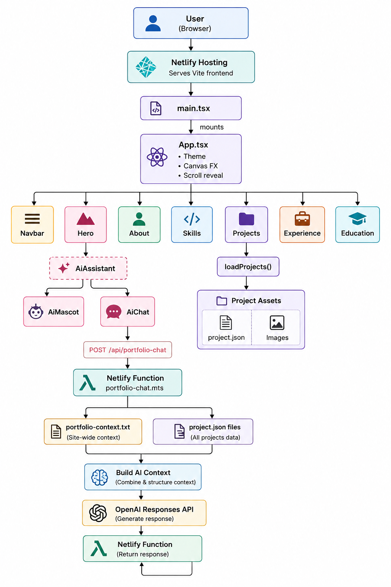

# Daniel Musselwhite — Portfolio

My developer portfolio, covering professional experience, personal projects, education, and technical background.

Built with React, TypeScript, and Vite, and hosted on Netlify. The site includes an AI assistant, Bloop, that answers questions using curated information about my work.

[Live site](https://danielmusselwhite.netlify.app) · [Technical documentation](./docs/TECHNICAL.md)

## Overview

The portfolio brings together:

- IncidentIQ, my current AI incident-analysis project.
- Selected projects with screenshots, engineering case studies, and expandable technology lists.
- Professional experience across finance, aviation, and insurance.
- Education and technical skills.
- Contact details and links to my GitHub and LinkedIn profiles.

The interface uses a teal-and-navy palette, bold borders, and offset shadows. It supports desktop and mobile layouts, light and dark themes, keyboard navigation, and reduced-motion preferences. Theme selection persists between visits.

Project galleries rotate automatically, with controls for pausing and selecting individual screenshots.

## Stack

| Area | Technologies |
| --- | --- |
| Frontend | React 19, TypeScript, Vite, CSS |
| Markdown rendering | React Markdown, Remark GFM |
| Backend | Netlify Functions, OpenAI Responses API |
| Hosting | Netlify |
| Development | npm, TypeScript compiler, Oxlint |

## Architecture



The React application serves the portfolio and chat interface. Chat requests are sent to `/api/portfolio-chat`, which is handled by a Netlify Function.

The function combines curated background information with project metadata and passes that context to the OpenAI Responses API. It also handles request validation, rate limiting, and API errors.

The assistant is instructed to keep answers relevant to the portfolio and distinguish professional experience from personal projects and work in progress.

## Local development

Install Node.js and npm, then clone the repository and install dependencies:

```powershell
git clone https://github.com/danielmusselwhite/DanielMusselwhitePortfolio.git
cd DanielMusselwhitePortfolio
npm ci
```

To enable the assistant, create a `.env` file in the repository root:

```env
OPENAI_API_KEY=your_openai_api_key
```

Set `OPENAI_MODEL` if you want to override the backend's default model.

Start the frontend and Netlify Function together:

```powershell
npm run dev:full
```

For frontend-only development:

```powershell
npm run dev
```

The assistant endpoint requires Netlify Dev.

## Scripts

| Command | Purpose |
| --- | --- |
| `npm run dev` | Start the Vite development server |
| `npm run dev:full` | Start the frontend and functions through Netlify Dev |
| `npm run build` | Run TypeScript checks and create the production build |
| `npm run preview` | Preview the frontend production build |
| `npm run lint` | Run Oxlint |

## Project organisation

| Path | Contents |
| --- | --- |
| `src/Components/` | Portfolio sections and shared UI components |
| `src/Components/Hero/AiAssistant/` | Bloop's mascot, interactions, and chat interface |
| `src/Components/Projects/` | Project cards, galleries, and engineering case studies |
| `src/assets/Projects/` | Project metadata and screenshots |
| `src/assets/portfolio-context.txt` | Curated background information for the assistant |
| `src/Types/` | Shared TypeScript types |
| `src/Utils/` | Project loading and other utilities |
| `src/styles/` | Additional layout and presentation styles |
| `netlify/functions/portfolio-chat.mts` | Assistant backend |
| `docs/TECHNICAL.md` | Implementation details |

## Updating the portfolio

Project descriptions, technologies, links, and engineering notes are defined in each project's `project.json` under `src/assets/Projects/`. Screenshots sit alongside that metadata in an `Images` directory.

The assistant reads project metadata and `src/assets/portfolio-context.txt`. The context file covers employment, education, and project background, including IncidentIQ's current status and planned capabilities.

Page styling is split between `src/App.css`, `src/styles/Comic.css`, and `src/styles/Sections.css`. The assistant retains its own component styles.

## Deployment

The site deploys through Netlify using `npm run build`, with `dist` as the publish directory. Functions are located in `netlify/functions/`.

Configure `OPENAI_API_KEY` in the Netlify environment settings. `OPENAI_MODEL` is optional.

See [the technical documentation](./docs/TECHNICAL.md) for further details.
